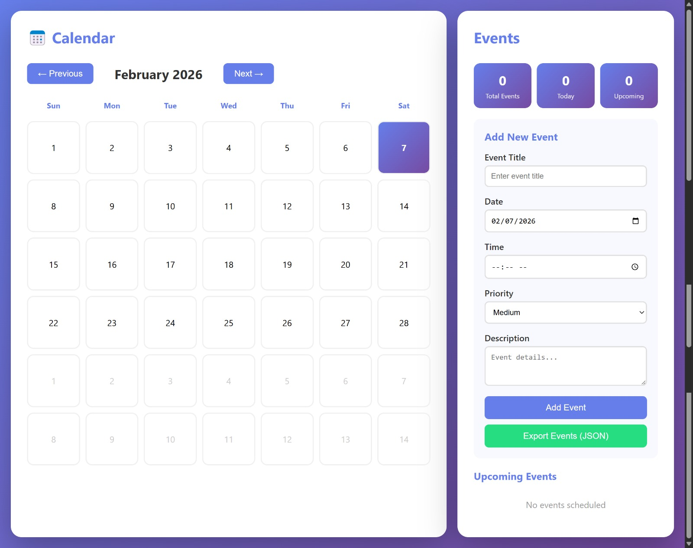

# Calendar & Event Manager FastAPI Application

A fullstack calendar and event management web application built with Python FastAPI backend.



## Features

- **Interactive Calendar**: Monthly view with navigation
- **Event Management**: Create, view, and delete events
- **Beautiful UI**: Purple gradient design with smooth animations
- **Priority Levels**: High, Medium, Low priority events
- **Statistics**: Track total, today, and upcoming events
- **Export**: Download events as JSON
- **FastAPI Backend**: Fast, modern Python API
- **REST API**: Full CRUD operations

## API Endpoints

- `GET /` - Serve the calendar web interface
- `GET /api/events` - Get all events
- `POST /api/events` - Create a new event
- `DELETE /api/events/{event_id}` - Delete an event

## API Documentation

Once running, access interactive API docs:
- Swagger UI: http://localhost:8000/docs
- ReDoc: http://localhost:8000/redoc

## Tech Stack

- **Backend**: Python 3.8+, FastAPI server handling API requests
- **Frontend**: HTML5, CSS3, Vanilla JavaScript
- **Database**: In-memory storage

## Usage

1. Navigate months using Previous/Next buttons
2. Click any date to select it
3. Fill in event details:
   - Title (required)
   - Date (required)
   - Time (optional)
   - Priority (low/medium/high)
   - Description (optional)
4. Click "Add Event" to create
5. View events in the sidebar
6. Click "Delete" to remove events
7. Click "Export Events (JSON)" to download all events

## Installation

### 1. Clone the repository:

```bash
git clone https://github.com/calchiwo/calender-and-event-manager.git
cd calender-and-event-manager
```

### 2. Install Dependencies
```bash
pip install -r requirements.txt
```

### 3. Run the Application
```bash
python app.py
```

Or using uvicorn directly:
```bash
uvicorn app:app --reload --host 0.0.0.0 --port 8000
```

### 3. Open in Browser
```
http://localhost:8000
```

## Authour
Caleb Wodi
